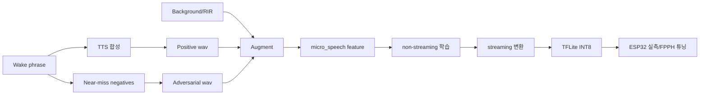

# LiveKit wakeword vs micro-wake-word (ESP32 관점 비교 보고서)

작성 목적: 서버 없이 ESP32에서 wake word를 안정적으로 동작시키기 위한 아키텍처 판단 근거 정리

---

## 1) 결론

- **런타임 베이스는 micro-wake-word 유지**가 현실적이다.
- **LiveKit은 데이터 생성·증강·평가 철학 차용**이 핵심이다.
- LiveKit ONNX frontend/embedding/classifier를 ESP32로 그대로 포팅하는 전략은
  입력 표현·런타임·연산 지원성·메모리 비용이 맞지 않아 비효율적이다.

핵심 판단:
- LiveKit: “좋은 데이터를 대량으로 만드는 공장”
- micro-wake-word: “MCU에서 돌릴 수 있게 학습/배포하는 엔진”

---

## 2) 구조 차이 요약

| 항목 | LiveKit wakeword | micro-wake-word | ESP32 해석 |
|---|---|---|---|
| 입력 표현 | 16k -> mel -> embedding `(16,96)` | 16k -> micro_speech 40-d feature | 상호 호환 어려움 |
| 런타임 | ONNX Runtime 중심 | TFLite Micro 중심 | ESP32는 micro 경로가 직접 타깃 |
| 분류기 | DNN / RNN / Conv-Attention | MixConv 계열 스트리밍 모델 | MCU는 소형 depthwise 계열 유리 |
| 내보내기 | ONNX 중심 | quantized streaming TFLite | ESP32 배포는 TFLite가 정답 |
| 평가 철학 | DET/FPPH/AUT 강조 | false accepts/hour 강조 | 철학은 결합 가능 |

---

## 3) LiveKit에서 반드시 가져올 것

1. **TTS 기반 화자 다양성 확대**
   - speaker blending / voice design prompt 기반 샘플 확장
2. **Phonetic adversarial negatives**
   - 비슷하게 들리지만 틀린 문구를 체계적으로 생성
3. **Waveform-level augmentation**
   - RIR / background SNR / EQ / distortion 누적 적용
4. **FPPH/DET 중심 평가**
   - accuracy 단일 지표 대신 운영점 기반 판단

---

## 4) 가져오지 말 것 (직포팅 비추천)

- ONNX mel frontend
- ONNX speech embedding frontend
- Conv-attention runtime를 MCU 실시간 경로에 직접 적용
- 데스크톱/모바일 추론 스택 전제 구성

이유:
- TFLM op/arena 제약과 맞지 않을 확률이 높고,
- 포팅 비용 대비 이득이 낮다.

---

## 5) 권장 파이프라인 (결합형)

---

## 6) 데이터 전략 권장치 (시작점)

- positive synthetic train: **8k ~ 12k**
- adversarial negative train: **8k ~ 12k**
- positive validation: **1.5k ~ 2.5k**
- ambient eval: **최소 5시간, 권장 10시간+**
- augmentation rounds: **2부터 시작**
- SNR: **0~20 dB (중심 5~15 dB)**

메모:
- 합성만으로는 실사용 편차를 다 못 잡는다.
- 실제 사용자 녹음(5~15%)을 반드시 섞는 것이 유리하다.

---

## 7) 모델/양자화 방향

- 모델 우선순위:
  1. DS-CNN-lite
  2. MixConv-lite
- 양자화:
  - Full INT8 강제
  - representative dataset 사용
  - unsupported op 발견 시 빌드/변환 실패 처리

실무 포인트:
- 모델을 키우기보다 데이터 + threshold/cooldown 설계가 ROI가 높다.

---

## 8) 실시간 후처리 권장

- VAD gate + wake score gate + cooldown 조합
- sliding window 4~6
- cutoff sweep 범위 0.92~0.97부터 탐색
- duplicate trigger 억제 로직 필수

---

## 9) 검증 지표 (출하 판단)

- **FAPH** (시간당 오탐)
- **FRR / recall**
- **DET 기반 cutoff 선택**
- 디바이스 지표:
  - latency
  - tensor arena
  - free heap

원칙:
- `val_accuracy` 단일 지표로 의사결정하지 않는다.

---

## 10) 즉시 실행 우선순위 (Top 3)

1. 런타임 고정: micro_speech + TFLM 일관성 확정
2. LiveKit식 데이터 생성 이식: near-miss + RIR/SNR + 화자 다양화
3. DS-CNN-lite vs MixConv-lite 2축 비교 + INT8 + ESP32 실측

---

## 11) 본 저장소 반영 방침

- 본 보고서는 의사결정 문서로 유지한다.
- 구현 단계는 `PHASES.md`의 **4-Phase 계획**을 기준으로 진행한다.
