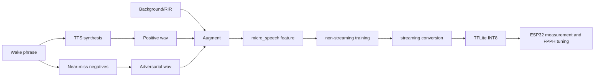

# LiveKit Wakeword vs microWakeWord for ESP32

Purpose: document the architecture decision for stable ESP32 wakeword inference
without a server.

---

## 1) Conclusion

- Keep **microWakeWord as the runtime base**.
- Borrow **LiveKit's data generation, augmentation, and evaluation ideas**.
- Do not directly port the LiveKit ONNX frontend, embedding, or classifier to
  ESP32. The input representation, runtime, supported ops, and memory cost do
  not fit the target well.

Core framing:
- LiveKit is a factory for creating better data.
- microWakeWord is the engine that can actually run on the MCU.

---

## 2) Structure Comparison

| Area | LiveKit wakeword | microWakeWord | ESP32 interpretation |
|------|------------------|---------------|----------------------|
| Input representation | 16 kHz -> mel -> embedding `(16,96)` | 16 kHz -> micro_speech 40-d feature | Hard to make mutually compatible |
| Runtime | ONNX Runtime centered | TFLite Micro centered | ESP32 directly fits the micro path |
| Classifier | DNN / RNN / Conv-Attention | MixConv streaming model family | Small depthwise-style models fit MCU better |
| Export | ONNX centered | Quantized streaming TFLite | TFLite is the ESP32 deployment target |
| Evaluation philosophy | DET / FPPH / AUT focused | false accepts/hour focused | Philosophies can be combined |

---

## 3) What To Borrow From LiveKit

1. **TTS-based speaker diversity**
   - Expand samples through speaker blending and voice design prompts.
2. **Phonetic adversarial negatives**
   - Generate phrases that sound similar but are not the wakeword.
3. **Waveform-level augmentation**
   - Apply RIR, background SNR, EQ, and distortion cumulatively.
4. **FPPH/DET-focused evaluation**
   - Choose operating points instead of trusting accuracy alone.

---

## 4) What Not To Port

- ONNX mel frontend
- ONNX speech embedding frontend
- Conv-attention runtime in the MCU realtime path
- Desktop/mobile inference stack assumptions

Reason:
- TFLM op and arena constraints are unlikely to fit cleanly.
- Porting cost is high relative to the benefit.

---

## 5) Recommended Combined Pipeline

---

## 6) Data Strategy Starting Point

- positive synthetic train: **8k-12k**
- adversarial negative train: **8k-12k**
- positive validation: **1.5k-2.5k**
- ambient eval: **minimum 5 hours, recommended 10+ hours**
- augmentation rounds: **start with 2**
- SNR: **0-20 dB, centered around 5-15 dB**

Notes:
- Synthetic data alone will not capture real-world variance.
- Mix in real user recordings, about 5-15%, when available.

---

## 7) Model and Quantization Direction

- Model priority:
  1. DS-CNN-lite
  2. MixConv-lite
- Quantization:
  - Force full INT8.
  - Use a representative dataset.
  - Fail build/conversion when unsupported ops appear.

Practical point:
- Data quality plus threshold/cooldown design has higher ROI than simply making the model larger.

---

## 8) Recommended Realtime Post-Processing

- Combine VAD gate, wake score gate, and cooldown.
- Use sliding window 4-6.
- Start cutoff sweep around 0.92-0.97.
- Add duplicate trigger suppression.

---

## 9) Release Metrics

- **FAPH**: false accepts per hour
- **FRR / recall**
- **DET-based cutoff selection**
- Device metrics:
  - latency
  - tensor arena
  - free heap

Principle:
- Do not make release decisions from `val_accuracy` alone.

---

## 10) Immediate Top 3 Priorities

1. Lock runtime consistency: micro_speech + TFLM.
2. Port LiveKit-style data generation ideas: near-miss, RIR/SNR, speaker diversity.
3. Compare DS-CNN-lite vs MixConv-lite with INT8 export and ESP32 measurements.

---

## 11) Repository Policy

- Keep this report as a decision document.
- Use the **4-phase plan** in `PHASES.md` for implementation sequencing.
